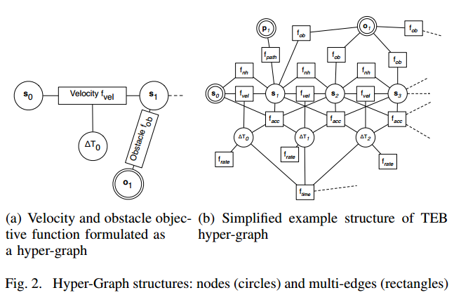
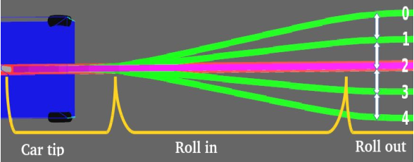
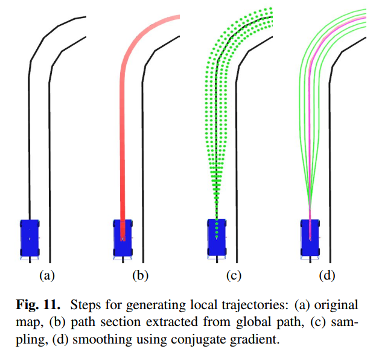
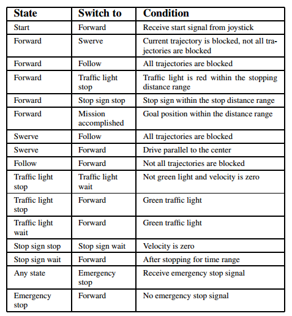

# Robot-Planning-and-Control
每周更新自动驾驶领域论文或相关算法实现，路径规划为主。
QQ交流群：861253468

# 基于学习的决策

## Learning Driver Behavior Models from Traffic Observations for Decision Making and Planning

摘要：对于复杂的驾驶员辅助系统和自动驾驶来说，随着时间的推移估计和预测交通状况是必不可少的能力。当需要更长的预测范围时，例如在决策或运动规划中，在不牺牲稳健性和安全性的前提下，不完全环境感知和随时间的随机情况发展所引起的不确定性是不可忽略的。**建立驾驶员与环境、道路网络和其他交通参与者相互作用的一致概率模型**是一个复杂的问题。本文通过建立描述驾驶员行为和计划的层次动态贝叶斯模型，对驾驶员的决策过程进行建模。这样，所有抽象级别的过程中的不确定性都可以用数学上一致的方式处理。由于驾驶员行为难以建模，我们提出了一种学习交通参与者行为的连续、非线性、上下文相关模型的方法。我们提出了一个期望最大化（EM）的方法来学习集成在DBN的模型从未标记的观测。实验表明，与只考虑车辆动力学的标准模型相比，该模型在估计和预测精度上有了显著提高。最后，提出了一种新的自主驾驶策略决策方法。它是基于一个连续的部分可观测马尔可夫决策过程（POMDP），使用该模型进行预测。

# 基于规则的决策

## Trajectory Optimization and Situational Analysis Framework for Autonomous Overtaking with Visibility Maximization

### IV. BEHAVIORAL PLANNER

- F: Follow ego-lane  沿车道行驶，需要约束路径偏离
- V: Visibility Maximization　最大化视野范围，需要放宽路径偏离约束
- O: Overtake　超车，需要计算超车路径
- M: Merge back　切换回原先的车道，需要计算换道路径
- W: Wait:　减速直至停止，观测环境变化

σ1 : Obstacle to be overtaken in ego lane detected.
σ2 : Visibility and overtaking time is sufficient / no feasible ego lane trajectory.
σ3 : Complete occlusion.
σ4 : Overtaking maneuver is completed.
σ5 : Incoming traffic in opposite lane detected and overtaking time is insufficient.
σ6 : Incoming traffic is cleared, and sufficiency criteria not yet fulfilled.
σ7 : Incoming traffic in opposite lane detected and overtaking time is insufficient.
σ8 : Incoming traffic is cleared, and sufficiency criteria are fulfilled.
σ9 : Incoming traffic in opposite lane detected and overtaking time is insufficient.
σ10 : Incoming traffic is cleared, and overtaking maneuver is completed or canceled.
σ11 : Merging maneuver is completed.

### V. TRAJECTORY GENERATION

#### A. Vehicle Model

#### B. Path Representation and Tracking

#### C. Road Boundaries

#### D. Obstacle Representation

#### E. Visibility Maximization

以“视野角”的大小表示感知情况，评估风险，并作为目标函数进行优化

#### F. MPC Formulation

### VI. SITUATIONAL ANALYSIS FRAMEWORK

#### A. Occupancy of Other Traffic Participants

超车的最佳时间为$t_{overtake}$

#### B. Information Sufficiency

信息充分性：如果车辆在sufficiency line之前，信息是充分的，视野良好；反之，视野受限，风险增加。

$S_{sufficient}$的值决定了行为的激进/保守程度，这里选取$S_{sufficient}$为一个车长的距离(4m)。

#### C. Overtaking Maneuver Risk Assessment

TODO：

查看文献27：dynamic virtual bumper

超车需要规划出一条超车参考路线，需要综合考虑车辆运动学和动力学约束。

### VII. SIMULATION RESULTS

#　轨迹预测

标题：Trajectron++: Multi-Agent Generative Trajectory Forecasting With Heterogeneous Data for Control.pdf

作者：Tim Salzmann　 Boris Ivanovic　Punarjay Chakravarty　Marco Pavone

团队：Autonomous Systems Lab, Stanford University 　　Ford Greenfield Labs

摘要：对人类在环境中的运动进行推理是实现安全的、具有社会意识的机器人导航的重要前提。因此，多智能体行为预测已经成为自动驾驶汽车等现代人机交互系统的核心组成部分。虽然存在多种用于轨迹预测的方法，但它们中的许多仅用一种语义类的智能体进行评估，并且仅使用先前的轨迹信息，忽略了从通用传感器到自治系统的在线可用的大量信息。为此，我们提出了Trajectron++，这是一个模块化的、图结构的递归模型，它可以在包含异构数据（如语义图和相机图像）的同时，预测具有不同语义类的一般智能体的轨迹。我们的模型与机器人规划和控制框架紧密结合，能够生成对主体运动规划产生重要影响的预测。我们在几个具有挑战性的现实世界轨迹预测数据集上演示了我们的模型的性能，其性能超过了一系列最先进的确定性和生成性方法。

# 基于人工势场的运动规划

# 基于采样的运动规划

## Lattice

## Trajectory Planning for BERTHA -a Local, Continuous Method

摘要：本文在总结前人研究成果的基础上，提出了在完全自主完成柏莎-奔驰纪念路线103公里的车辆上进行轨迹规划的策略。我们提出一个由变分公式导出的局部连续方法。解的轨迹是一个目标函数的约束极值，该目标函数用于表达动态可行性和舒适性。静态和动态障碍物约束以多边形的形式合并。这些约束经过精心设计，以确保解收敛到单个全局最优解。

### II. RELATED WORK

#### A. Preliminaries

#### B. Objective function

代价函数组成：

#### C. Constraint functions

约束项：内部约束、外部约束

内部约束：最大曲率、最大加速度等

外部约束：物体碰撞

进行物体碰撞检测，自车用多个圆表示，障碍物用多边形表示。

#### D. Building constraint polygons from sensor data

静态障碍物：left-right decision 根据简单的几何结构，将障碍物分配到左右两边

动态障碍物：分为迎面车辆，划分在右侧；超车车辆，划分在左侧

移动障碍物预测：常速并且与右边界保持固定的距离。

#### E. Distance function

//TODO

基于优化的路径选择

#### F. Re-planning scheme

#### G. Constrained optimization

//TODO

# 基于优化的运动规划

## Baidu Apollo EM Motion Planner

摘要-本文介绍了一个基于百度阿波罗（开源）自主驾驶平台的实时运动规划系统。开发的系统旨在解决工业4级运动规划问题，同时考虑安全性、舒适性和可扩展性。该系统以分层的方式覆盖多车道和单车道的自主驾驶：（1）系统顶层是一种多车道策略，通过比较并行计算的车道水平轨迹来处理车道变换情况。（2） 在车道级轨迹生成器中，基于Frenet框架迭代求解路径和速度优化问题。（3） 针对路径和速度优化问题，提出了动态规划和基于样条函数的二次规划相结合的方法，构造了一个可扩展且易于调整的框架，同时处理交通规则、障碍物决策和平滑度。该规划方法可扩展到高速公路和低速城市驾驶场景。我们还通过场景说明和道路测试结果演示了该算法。

**A. Multilane Strategy**

参考：

[1] https://blog.csdn.net/yuxuan20062007/article/details/83629595

## Optimization-Based Collision Avoidance

摘要：利用凸优化的强对偶性，提出了一种将不可微碰撞避免约束转化为光滑非线性约束的新方法。我们关注的是一个控制对象，其目标是在n维空间中移动时避开障碍物。所提出的重构不引入近似，并且适用于一般的障碍物和受控对象，它们可以表示为凸集的并集。我们将我们的结果与符号距离的概念联系起来，符号距离在传统的轨迹生成算法中得到了广泛的应用。我们的方法可以应用于一般的导航和轨迹规划任务，并且平滑特性允许使用通用的基于梯度和Hessian的优化算法。最后，在无法避免碰撞的情况下，我们的框架允许我们找到“至少有吸引力”的轨迹，以穿透力来衡量。我们证明了我们的框架在四直升机导航和自动泊车问题上的有效性，并且我们的数值实验表明，所提出的方法能够在紧环境下实现基于实时优化的轨迹规划问题。我们实现的源代码见https://github.com/XiaojingGeorgeZhang/OBCA。

## 

## Integrated Online Trajectory Planning and Optimization in Distinctive Topologies

这篇文章**最为**详细地说明了TEB实现。

参考：

[1] http://www.pianshen.com/article/4783688865/

## Elastic Bands: Connecting Path Planning and Control

弹性带（EB）起源文章

## Kinodynamic Trajectory Optimization and Control for Car-Like Robots

这篇文章介绍**较为**详细地说明了TEB实现。

## Efficient Trajectory Optimization using a Sparse Model

**时间弹性带算法使用g2o框架求解**

摘要-“时间弹性带(TEB)”方法通过随后修改由全局规划器生成的初始轨迹来优化机器人轨迹。轨迹优化所考虑的目标包括但不限于总路径长度、轨迹执行时间、与障碍物的分离、通过中间路径点以及满足机器人的动力学、运动学和几何约束。TEB明确地考虑了运动的时空方面的动态约束，如有限的机器人速度和加速度。轨迹规划实时运行，使得TEB能够应对动态障碍物和运动约束。将“TEB问题”描述为一个尺度化的多目标优化问题。大多数目标是局部的，只与一小部分参数有关，因为它们只依赖于几个连续的机器人状态。这种局部结构产生一个稀疏的系统矩阵，从而允许使用快速有效的优化技术，如开源框架“g2o”来解决TEB问题。g2o稀疏系统解算器已成功地应用于VSLAM问题。本文描述了g2o框架在TEB轨迹修正中的应用和适应性。仿真和实际机器人实验结果表明，该方法具有良好的鲁棒性和计算效率。

### II. TIMED ELASTIC BAND

#### A. Definition of Timed Elastic Band (TEB)

#### B. Problem representation as a Hyper-Graph

#### C. Control flow

## G2o: A general framework for graph optimization

摘要-机器人学和计算机视觉中的许多常见问题，包括各种类型的同时定位和映射（SLAM）或束平差（BA），可以**用图形表示的误差函数的最小二乘优化来表达**。本文描述了这些问题的一般结构，并提出了**G2O，一个开源的C++框架**，用于**优化基于图的非线性误差函数**。我们的系统被设计成很容易扩展到各种各样的问题，一个新的问题通常可以在几行代码中指定。当前的实现为SLAM和BA的几种变体提供了解决方案。我们提供了对大量真实世界和模拟数据集的评估。结果表明，虽然g2o是通用的，但它的性能可以与针对特定问题的现有方法的实现相媲美。

g2o的本质：g2o是一个算法集的C++实现，而并不是在算法理论上的创新，即根据前人求解非线性最小二乘的理论，根据具体的问题，选用最合适的算法。

它是一个平台，你可以加入你自己的线性方程求解器，编写自己的优化目标函数，确定更新的方式。g2o的作者说Guassian-Newton和Levenberg-Marquardt方法比较naive，但是g2o的本质就是这些算法的实现。事实上，g2o iSAM SPA和 sSPA等非线性优化算法只是在非线性问题线性化时处理得不一样，在线性化后要求解线性方程都是利用了已有的linear solver库来求解，如 CSparse CHOLMOD PCG等，他们都需要依靠Eigen这个线性代数库。

g2o的用途：很多机器人的应用如SLAM（同步定位与制图）还有计算机视觉中的光束优化（bundle adjustment 都会涉及到最小化非线性误差函数的问题。这类应用中，**非线性误差函数可以用图(graph)的形式来表征**。整个问题的求解就是要找到最符合观测量的相机参数或机器人状态。

参考：

[1] https://blog.csdn.net/zhongjin616/article/details/15498779

# 组合运动规划（路线图）

　

# 路径跟踪

## Geometric Path Tracking Algorithm for Autonomous Driving in Pedestrian Environment

摘要：本文提出了一种用于自动驾驶的纯跟踪路径跟踪算法的替代公式。目前的方法有偷工减料的倾向，因此导致路径跟踪精度差。该方法**不仅考虑了被跟踪点的相对位置，而且还考虑了被跟踪点的路径方向**。根据车辆运动方程设计了转向控制律。该算法的有效性通过在无人驾驶的高尔夫球车上实现，并在步行环境下进行了测试。实验结果表明，新算法在不增加额外计算量的情况下，使同一给定预设路径的均方根（RMS）交叉跟踪误差降低46%，且**保持了原纯跟踪控制器的无抖振特性**。

改进了PPC算法： 减少过弯道时切角和超调，保持无抖振特性。

### III. PURE PURSUIT PATH TRACKING

#### B. Pure Pursuit Algorithm

图中，$Ｌ$为车辆轴距，$L_{fw}$为lookahead距离。$L_{fw}=kv(t)\in{[L_{min},L_{max}]}$

根据Fig. 4，三角形定理有：

$$\frac{L_{fw}}{sin(2\eta)}=\frac{R}{sin(\frac{\pi}{2}-\eta)}$$

$$\frac{L_{fw}}{２sin(\eta)cos(\eta)}=\frac{R}{cos(\eta)}$$

$$\frac{L_{fw}}{sin(\eta)}=2R$$

那么，曲率$\kappa=\frac{1}{R}=\frac{2sin(\eta)}{L_{fw}}$

（１）以$(v,\omega)$控制的底盘

很多移动机器人，较为代表的是差速轮底盘的移动机器人，车辆的控制指令通常为$(v,\omega)$，而$\omega=v(t)\kappa$

所以，计算出转角$\eta$，根据当前车辆速度$v(t)$，便可求出需要的角速度$\omega$，下发控制指令$(v,\omega)$即可。

（２）以$(v,\delta)$控制的底盘

较为代表的是乘用车为代表的阿卡曼模型和全驱动的双阿克曼模型，车辆控制指令为$(v,\delta)$

对于阿克曼模型

$$tan(\delta)=\frac{L}{R}$$

$$\delta=tan^{-1}(\kappa L)$$

$$\delta(t)=tan^{-1}(\frac{2Lsin(\eta(t))}{L_{fw}})$$

(2)对于双阿克曼模型

$$tan(\delta)=\frac{L}{2R}$$

$$\delta=tan^{-1}(\frac{\kappa L}{2})$$

$$\delta(t)=tan^{-1}(\frac{Lsin(\eta(t))}{L_{fw}})$$

### IV. MODIFIED PURE PURSUIT PATH TRACKING

改进的PPC算法考虑了被跟踪点$(x_{p},y_{p})$的方向（$i$点的方向由$i+1$点的连线方向确定）。

当考虑了被跟踪点的方向后，跟踪时会产生垂直偏移$d$，这会导致跟踪固定曲率的路径时产生稳态误差，因此需要补偿$d$。

补偿方式：将跟踪点的位置$(x_{p},y_{p},\theta_{p})$，沿着$(\theta_{p}+\frac{\pi}{2})$方向，偏移$-d$的距离作为补偿后的跟踪位置，计算公式如下：

对应的转角用纯跟踪算法计算即可。

# 盲区感知

## Autonomous Predictive Driving for Blind Intersections

# Autoware实现

## Open Source Integrated Planner for Autonomous Navigation in Highly Dynamic Environments

这篇文章主要介绍Autoware的系统架构和部分实现细节。

### 5. Local Planner

#### 5.1. Roll-Out Generation

**样条曲线：**

Autoware局部路径规划所使用的样条曲线，分为三段：car tip margin， roll-in margin，  roll-out section，使得转角平滑。

**样条插值：**

很多样条插值方法对输入噪声敏感，如当输入点过于紧密时，三次样条插值方法会产生严重震荡。Autoware 使用分段插值（piece wise interpolation）和共轭梯度（conjugate gradient）平滑的方法生成路径点。

> 共轭梯度（conjugate gradient）平滑方法
>
> TODO

#### 5.2. Cost Calculation

代价指标：priority cost, collision cost and transition cost

**障碍物表示**

障碍物表示：Ｂounding Boxes 、点云簇

优缺点：Ｂounding Boxes精度低，障碍物检测需要计算性能高；点云簇正好相反。

Ａutoware改进了障碍物的点云簇表示，最多采样16个点（点数可配置）就可以表示一个物体。

##### 5.2.1. Center Cost

与中心参考线距离的代价

##### 5.2.2. Transition Cost

各条roll-outs与当前选择的路径的垂直距离

##### 5.2.3. Collision Cost

分两段：

第一段是car tip margin＋roll-in margin连接的样条

碰撞检测使用“point inside a circle”，以路径点为圆心，车宽的一半＋安全距离为半径，看障碍物轮廓点是否在圆内即可。

第一段是 roll-out section样条

由于样条是平行的，可方便的计算是否碰撞

### 6. Behavior Generation Using State Machine

Behavior states transition conditions.

### 几点疑问

１、动态障碍物的碰撞检测只检查空间上的碰撞，没检查时间上的碰撞？

２、采样的轨迹没有速度信息，速度是如何给定的？

