# Robot-Planning-and-Control
每周更新自动驾驶领域论文或相关算法实现，路径规划为主。
QQ交流群：861253468

# 基于学习的决策

## Learning Driver Behavior Models from Traffic Observations for Decision Making and Planning

摘要：对于复杂的驾驶员辅助系统和自动驾驶来说，随着时间的推移估计和预测交通状况是必不可少的能力。当需要更长的预测范围时，例如在决策或运动规划中，在不牺牲稳健性和安全性的前提下，不完全环境感知和随时间的随机情况发展所引起的不确定性是不可忽略的。**建立驾驶员与环境、道路网络和其他交通参与者相互作用的一致概率模型**是一个复杂的问题。本文通过建立描述驾驶员行为和计划的层次动态贝叶斯模型，对驾驶员的决策过程进行建模。这样，所有抽象级别的过程中的不确定性都可以用数学上一致的方式处理。由于驾驶员行为难以建模，我们提出了一种学习交通参与者行为的连续、非线性、上下文相关模型的方法。我们提出了一个期望最大化（EM）的方法来学习集成在DBN的模型从未标记的观测。实验表明，与只考虑车辆动力学的标准模型相比，该模型在估计和预测精度上有了显著提高。最后，提出了一种新的自主驾驶策略决策方法。它是基于一个连续的部分可观测马尔可夫决策过程（POMDP），使用该模型进行预测。

# 基于规则的决策

## Trajectory Optimization and Situational Analysis Framework for Autonomous Overtaking with Visibility Maximization

### IV. BEHAVIORAL PLANNER

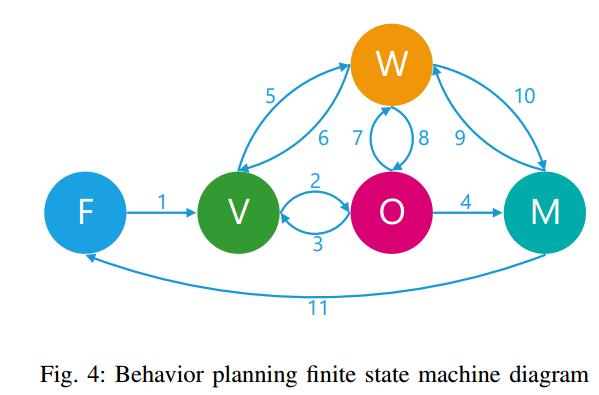

- F: Follow ego-lane  沿车道行驶，需要约束路径偏离
- V: Visibility Maximization　最大化视野范围，需要放宽路径偏离约束
- O: Overtake　超车，需要计算超车路径
- M: Merge back　切换回原先的车道，需要计算换道路径
- W: Wait:　减速直至停止，观测环境变化

σ1 : Obstacle to be overtaken in ego lane detected.
σ2 : Visibility and overtaking time is sufficient / no feasible ego lane trajectory.
σ3 : Complete occlusion.
σ4 : Overtaking maneuver is completed.
σ5 : Incoming traffic in opposite lane detected and overtaking time is insufficient.
σ6 : Incoming traffic is cleared, and sufficiency criteria not yet fulfilled.
σ7 : Incoming traffic in opposite lane detected and overtaking time is insufficient.
σ8 : Incoming traffic is cleared, and sufficiency criteria are fulfilled.
σ9 : Incoming traffic in opposite lane detected and overtaking time is insufficient.
σ10 : Incoming traffic is cleared, and overtaking maneuver is completed or canceled.
σ11 : Merging maneuver is completed.

### V. TRAJECTORY GENERATION

#### A. Vehicle Model

#### B. Path Representation and Tracking

#### C. Road Boundaries

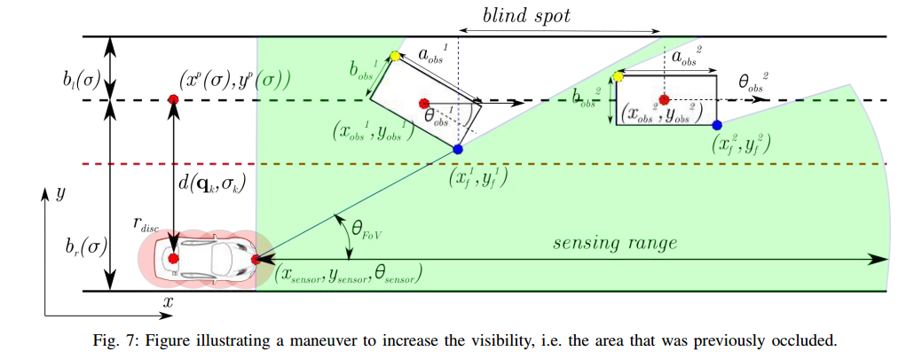

#### D. Obstacle Representation

#### E. Visibility Maximization

以“视野角”的大小表示感知情况，评估风险，并作为目标函数进行优化

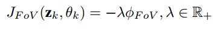

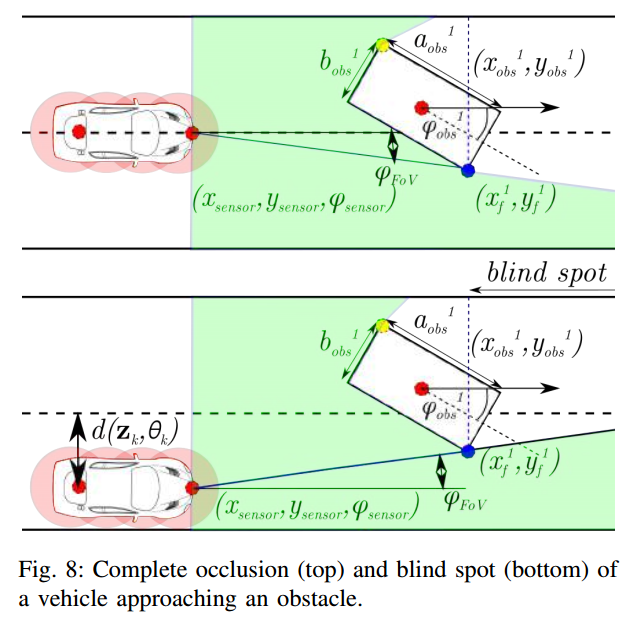

#### F. MPC Formulation

### VI. SITUATIONAL ANALYSIS FRAMEWORK

#### A. Occupancy of Other Traffic Participants

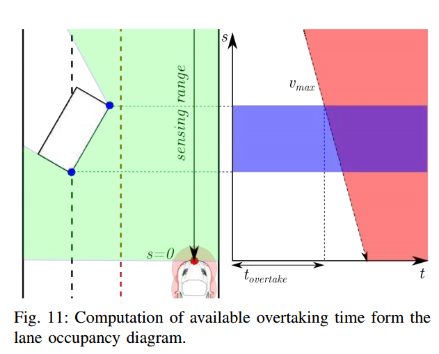

超车的最佳时间为$t_{overtake}$

#### B. Information Sufficiency

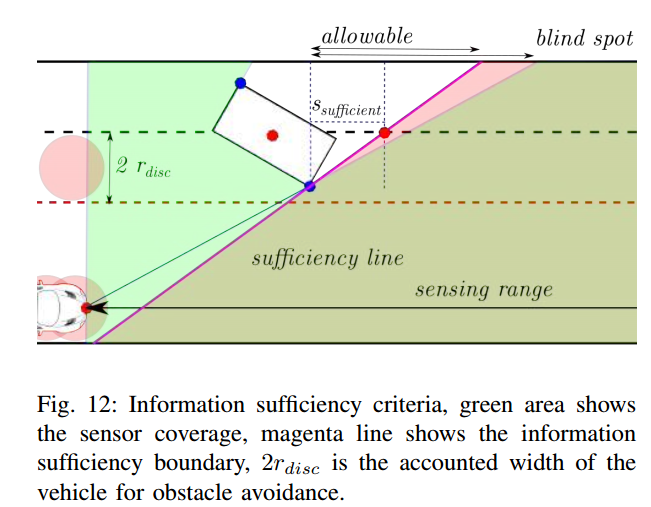

信息充分性：如果车辆在sufficiency line之前，信息是充分的，视野良好；反之，视野受限，风险增加。

$S_{sufficient}$的值决定了行为的激进/保守程度，这里选取$S_{sufficient}$为一个车长的距离(4m)。

#### C. Overtaking Maneuver Risk Assessment

TODO：

查看文献27：dynamic virtual bumper

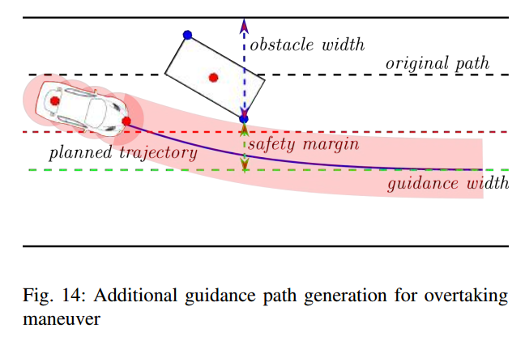

超车需要规划出一条超车参考路线，需要综合考虑车辆运动学和动力学约束。

### VII. SIMULATION RESULTS

#　轨迹预测

# Prediction

标题：Trajectron++: Multi-Agent Generative Trajectory Forecasting With Heterogeneous Data for Control.pdf

作者：Tim Salzmann　 Boris Ivanovic　Punarjay Chakravarty　Marco Pavone

团队：Autonomous Systems Lab, Stanford University 　　Ford Greenfield Labs

摘要：对人类在环境中的运动进行推理是实现安全的、具有社会意识的机器人导航的重要前提。因此，多智能体行为预测已经成为自动驾驶汽车等现代人机交互系统的核心组成部分。虽然存在多种用于轨迹预测的方法，但它们中的许多仅用一种语义类的智能体进行评估，并且仅使用先前的轨迹信息，忽略了从通用传感器到自治系统的在线可用的大量信息。为此，我们提出了Trajectron++，这是一个模块化的、图结构的递归模型，它可以在包含异构数据（如语义图和相机图像）的同时，预测具有不同语义类的一般智能体的轨迹。我们的模型与机器人规划和控制框架紧密结合，能够生成对主体运动规划产生重要影响的预测。我们在几个具有挑战性的现实世界轨迹预测数据集上演示了我们的模型的性能，其性能超过了一系列最先进的确定性和生成性方法。

# 路径跟踪

## Geometric Path Tracking Algorithm for Autonomous Driving in Pedestrian Environment

摘要：本文提出了一种用于自动驾驶的纯跟踪路径跟踪算法的替代公式。目前的方法有偷工减料的倾向，因此导致路径跟踪精度差。该方法**不仅考虑了被跟踪点的相对位置，而且还考虑了被跟踪点的路径方向**。根据车辆运动方程设计了转向控制律。该算法的有效性通过在无人驾驶的高尔夫球车上实现，并在步行环境下进行了测试。实验结果表明，新算法在不增加额外计算量的情况下，使同一给定预设路径的均方根（RMS）交叉跟踪误差降低46%，且**保持了原纯跟踪控制器的无抖振特性**。

改进了PPC算法： 减少过弯道时切角和超调，保持无抖振特性。

### III. PURE PURSUIT PATH TRACKING

#### B. Pure Pursuit Algorithm

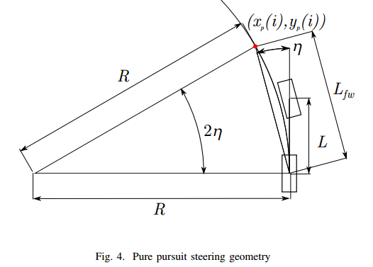

图中，$Ｌ$为车辆轴距，$L_{fw}$为lookahead距离。$L_{fw}=kv(t)\in{[L_{min},L_{max}]}$

根据Fig. 4，三角形定理有：

$$\frac{L_{fw}}{sin(2\eta)}=\frac{R}{sin(\frac{\pi}{2}-\eta)}$$

$$\frac{L_{fw}}{２sin(\eta)cos(\eta)}=\frac{R}{cos(\eta)}$$

$$\frac{L_{fw}}{sin(\eta)}=2R$$

那么，曲率$\kappa=\frac{1}{R}=\frac{2sin(\eta)}{L_{fw}}$

（１）以$(v,\omega)$控制的底盘

很多移动机器人，较为代表的是差速轮底盘的移动机器人，车辆的控制指令通常为$(v,\omega)$，而$\omega=v(t)\kappa$

所以，计算出转角$\eta$，根据当前车辆速度$v(t)$，便可求出需要的角速度$\omega$，下发控制指令$(v,\omega)$即可。

（２）以$(v,\delta)$控制的底盘

较为代表的是乘用车为代表的阿卡曼模型和全驱动的双阿克曼模型，车辆控制指令为$(v,\delta)$

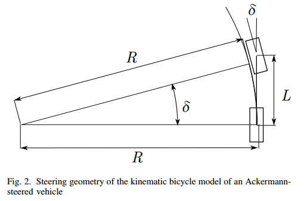

对于阿克曼模型

$$tan(\delta)=\frac{L}{R}$$

$$\delta=tan^{-1}(\kappa L)$$

$$\delta(t)=tan^{-1}(\frac{2Lsin(\eta(t))}{L_{fw}})$$

(2)对于双阿克曼模型

$$tan(\delta)=\frac{L}{2R}$$

$$\delta=tan^{-1}(\frac{\kappa L}{2})$$

$$\delta(t)=tan^{-1}(\frac{Lsin(\eta(t))}{L_{fw}})$$

### IV. MODIFIED PURE PURSUIT PATH TRACKING

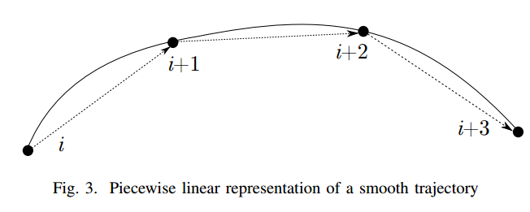

改进的PPC算法考虑了被跟踪点$(x_{p},y_{p})$的方向（$i$点的方向由$i+1$点的连线方向确定）。

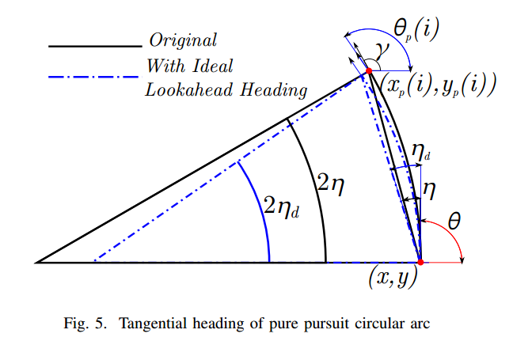

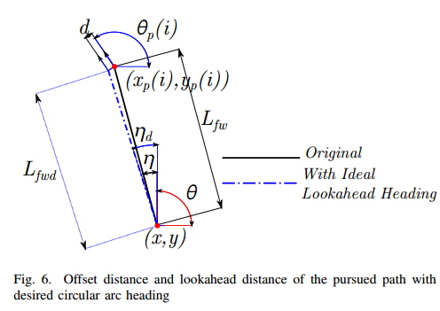

当考虑了被跟踪点的方向后，跟踪时会产生垂直偏移$d$，这会导致跟踪固定曲率的路径时产生稳态误差，因此需要补偿$d$。

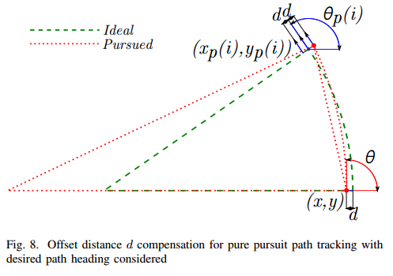

补偿方式：将跟踪点的位置$(x_{p},y_{p},\theta_{p})$，沿着$(\theta_{p}+\frac{\pi}{2})$方向，偏移$-d$的距离作为补偿后的跟踪位置，计算公式如下：
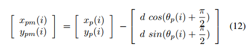

对应的转角用纯跟踪算法计算即可。

# 盲区感知

## Autonomous Predictive Driving for Blind Intersections

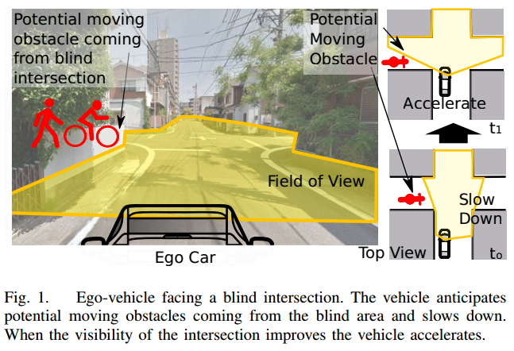

